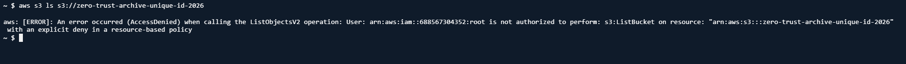
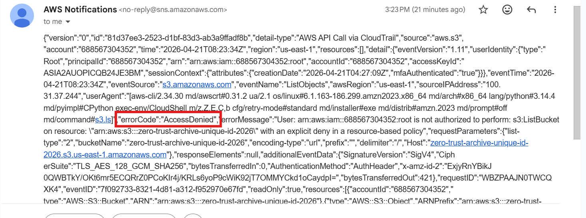
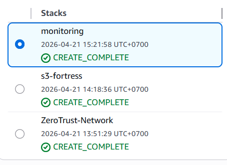

# Automated-Zero-Trust-Data-Perimeter-IDS

## 🚀 Project Overview
In a standard AWS setup, an Identity (IAM) leak can lead to a total data breach. This project implements a **Defense-in-Depth** architecture that creates a "Network Perimeter" around sensitive data. 

Even with full Administrator credentials, data remains inaccessible unless the request originates from a cryptographically verified **VPC Endpoint**.

### **Core Features**
* **Honed Networking:** Custom multi-tier VPC with 100% isolated private subnets.
* **Cost-Optimized Architecture:** Used **S3 Gateway Endpoints** to eliminate NAT Gateway costs ($30+/mo saved).
* **Zero-Trust Storage:** S3 Bucket Policy that enforces access only via specific VPC Endpoints.
* **Custom IDS (Intrusion Detection System):** Automated alerting pipeline using **CloudTrail Data Events**, **EventBridge**, and **SNS**.

---

## 🏗️ The Architecture

1.  **VPC Layer:** No Internet Gateway or NAT Gateway attached to private subnets.
2.  **Access Layer:** Direct, private routing to S3 via AWS internal network.
3.  **Monitoring Layer:** Real-time log analysis for `AccessDenied` errors.

---

## 🛠️ Deployment Guide

This project is broken into three modular CloudFormation stacks. Deploy them in the following order:

### **Phase 1: Networking (`networking/vpc-foundation.yaml`)**
This creates the VPC, Private Subnets, and the S3 Gateway Endpoint. 
* *Note:* Ensure you save the `S3GatewayEndpointID` from the Outputs tab for the next step.

### **Phase 2: Storage (`storage/s3-fortress.yaml`)**
This provisions the S3 Bucket and applies the Zero-Trust policy.
* **Security Logic:** Explicitly denies all actions if `aws:SourceVpce` does not match your Endpoint ID.

### **Phase 3: Monitoring (`monitoring/intrusion-detection.yaml`)**
This sets up the "Security Camera."
* Creates a **CloudTrail Data Trail** to watch S3 API calls.
* Deploys an **EventBridge Rule** to filter for `errorCode: AccessDenied`.
* Connects an **SNS Topic** to your email for instant alerting.

---

## 🧪 The Security "Drill" (Proof of Concept)

### **1. Unauthorized Access Attempt**
To test the perimeter, I attempted to list the bucket contents via **AWS CloudShell**. Since CloudShell operates outside my custom VPC, the request was blocked by the resource-based policy, even though I was logged in as the Root/Admin user.

> **Command:** `aws s3 ls s3://my-secure-archive-bucket`

### **2. Automated Intrusion Alert**
Within minutes of the failed attempt, the **EventBridge Rule** detected the `AccessDenied` error in the CloudTrail logs and triggered an SNS notification to my email.

### **3. Stack Infrastructure**
The entire environment is managed via Infrastructure as Code (IaC) for 100% reproducibility.

---

## 💰 Cost Analysis (Free Tier Friendly)
This architecture was designed to run at **$0.00/month** on the AWS Free Tier:
* **VPC Endpoints (Gateway):** $0.00
* **CloudTrail:** Management events are free; S3 Data events are $0.10 per 100k events (Minimal for this POC).
* **SNS:** First 1,000 emails/mo are free.
* **NAT Gateway Avoidance:** Saved ~$32.00/mo in provisioning fees.

---
